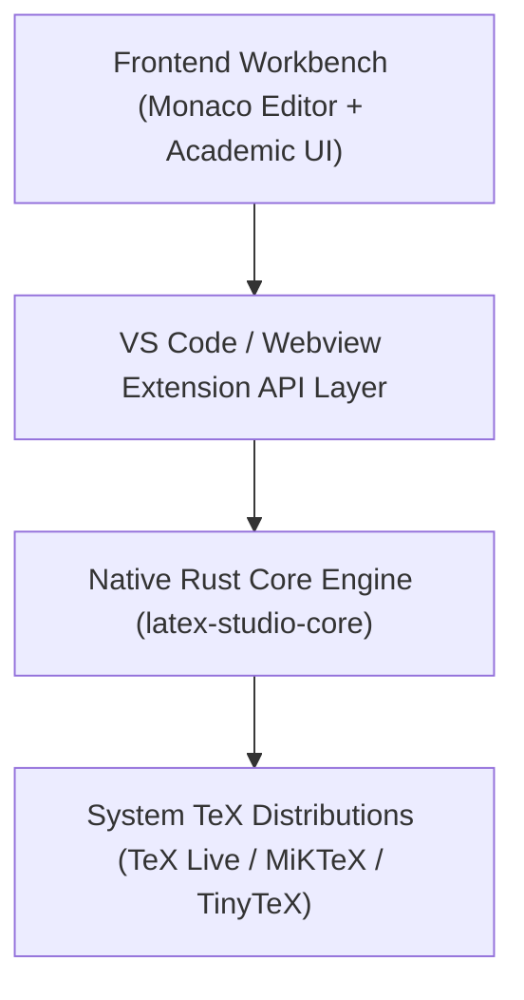

# LaTeX Studio

> **LaTeX Studio** is an open-source, high-performance desktop IDE and scientific writing workstation designed for researchers, scientists, students, and engineers. It delivers an out-of-the-box, frictionless environment for LaTeX authoring, real-time compilation, and PDF synchronization with a progressive lightweight architecture.

---

## 🎯 Key Capabilities & Highlights

- ⚡ **Zero-Configuration Toolchain**: Auto-detects TeX Live, MiKTeX, MacTeX, and TinyTeX. Pre-configures XeLaTeX, pdfLaTeX, LuaLaTeX, and latexmk build recipes.
- 🦀 **Progressive Lightweight Architecture**: Powered by a high-throughput native Rust core (`latex-studio-core`), providing microsecond log parsing, fast toolchain detection, and streaming BibTeX indexing.
- 📖 **Embedded PDF Viewer & SyncTeX**: Side-by-side preview with sub-second bi-directional synchronization (source code $\leftrightarrow$ PDF).
- 🧠 **AI Scientific Writing & Tone Assistant**: Refine academic tone, convert prose to an objective impersonal stance, eliminate wordy redundancies, and normalize LaTeX math punctuation (`Ctrl+Alt+P`).
- 💡 **Intelligent TeX Error Explainer**: Plain-English error diagnostics for obscure TeX log errors (`Missing $ inserted`, `Underfull/Overfull \hbox`, `Undefined control sequence`) with one-click QuickFixes.
- 📐 **Math Live Preview & KaTeX Hover**: Live formula rendering in hover tooltips and natural language search for mathematical and machine learning equations.
- 📚 **Citation & Bibliography Intelligence**: Automatic `.bib` database indexing, fuzzy citation completion (`\cite{...}`), and rich hover reference cards.
- 📊 **Academic Table Generator**: Instant conversion of raw Markdown tables or CSV/TSV spreadsheets into publication-grade `booktabs` tables (`\toprule`, `\midrule`, `\bottomrule`).
- 🎨 **Academic Template Center**: Project scaffolding for IEEE, ACM, graduation theses (`ctex`), and Beamer presentations.
- 🌳 **Real-Time Document Outline**: Dynamic structure tree tracking `\part` through `\subparagraph` with instant navigation.

---

## 🏗️ Architecture Overview

LaTeX Studio utilizes a two-tier progressive architecture:



1. **Frontend / Workbench**: High-productivity editing powered by Monaco Editor, customizable layout, status bar quick actions, and embedded PDF preview.
2. **Native Rust Core Engine (`src-tauri/`)**: High-performance, zero-overhead systems layer handling:
   - Toolchain & engine auto-discovery (`src/detector.rs`).
   - Microsecond build log & BadBox parsing (`src/parser.rs`).
   - High-throughput streaming BibTeX reference indexing (`src/bibtex.rs`).
   - Native compilation execution pipeline (`src/compiler.rs`).

---

## 🗺️ Project Milestones & Roadmap

For our comprehensive engineering roadmap, release plans, and completed milestone progress, see [ROADMAP.md](ROADMAP.md).

---

## 🛠️ Branching Strategy (GitFlow)

This repository follows standard **GitFlow** and **Semantic Versioning (SemVer)**:
- **`main`**: Production and stable release branch.
- **`develop`**: Primary integration branch for active development.
- **`feature/*`**: Dedicated feature branches merged into `develop` via Pull Requests.
- **`release/*`** & **`hotfix/*`**: Release stabilization and emergency patch branches.

---

## 🚀 Getting Started

### Prerequisites
- Node.js (v20 or newer)
- Rust toolchain (1.75+ or newer, via `rustup`)
- A TeX distribution on your system:
  - Windows: [TeX Live](https://www.tug.org/texlive/) or [MiKTeX](https://miktex.org/)
  - macOS: [MacTeX](https://www.tug.org/mactex/)
  - Linux: `texlive-full`

### Build from Source
```bash
# Clone the repository
git clone https://github.com/BerryUIKI/LaTeX-Studio.git
cd LaTeX-Studio

# Install JavaScript dependencies
npm install

# Test and verify native Rust core
cd src-tauri
cargo test
cd ..

# Compile the LaTeX Studio built-in extension
npm run gulp compile-extension:latex
```

---

## 🤝 Contributing

Contributions are welcome! Please check [CONTRIBUTING.md](CONTRIBUTING.md) for development workflows, coding standards, and pull request guidelines.

---

## 📄 License

Licensed under the [MIT](LICENSE.txt) license.
